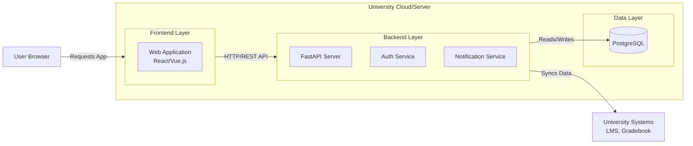
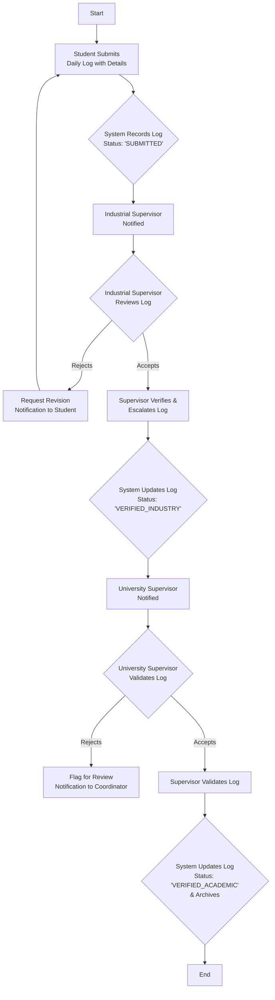

# IPT Service Backend

A high-performance, scalable backend service for managing Industrial Practical Training (IPT) programs, built with **FastAPI**. This service acts as the central hub for students, university staff, and industry partners to coordinate, verify, and document internship experiences.

## 📋 Domain Overview & Core Value Proposition

The IPT Service is a **multi-sided platform** designed to solve critical friction points in university-led industrial training programs. It bridges the gap between academia and industry by providing a structured, transparent, and verifiable workflow for the entire internship lifecycle.

**Core Stakeholders:**
*   **Student:** Applies for placements and submits verifiable work logs.
*   **Industrial Supervisor:** Mentors the student and verifies the quality and authenticity of their work.
*   **University Supervisor:** Validates the experience for academic credit and ensures learning objectives are met.
*   **IPT Coordinator:** Manages the entire program, matches students with companies, and configures the system.

## 🎯 Functional Requirements (Prioritized)

### Must-Have (MVP)
1.  **Role-Based Access Control (RBAC)** for four user types.
2.  **Vacancy Management & Application System** for students and coordinators.
3.  **The Verification Chain:**
    *   Student submits an arrival note and daily logs (text + files).
    *   Industrial Supervisor verifies and escalates logs.
    *   University Supervisor provides final academic validation.
4.  **Coordinator Dashboard** for oversight and user management.
5.  **Basic Notification System** for key events.

### Should-Have (Post-MVP)
6.  University Single Sign-On (SSO) integration.
7.  Digital Assessment Forms integrated with university systems.
8.  Enhanced dashboards for University Supervisors.
9.  Automated reminder system.

### Could-Have (Future)
10. Smart Matching Algorithm for placements.
11. Advanced Analytics & Reporting dashboard.
12. Verifiable Digital Portfolio for students.
13. "Soft Geofence" for log submission integrity.

## 🏗️ System Architecture & Design

### High-Level Architecture


### Core Verification Workflow


## 📁 Project Structure (FastAPI Backend)

```
ipt_backend/
├── app/
│   ├── main.py                 # FastAPI app creation & root router
│   ├── core/                   # Core application config & security
│   │   ├── config.py           # Pydantic settings management
│   │   ├── security.py         # JWT token handling, password hashing
│   │   └── dependencies.py     # Custom FastAPI dependencies
│   ├── models/                 # SQLAlchemy ORM models
│   │   ├── user.py             # User, Student, Supervisor models
│   │   ├── vacancy.py          # Vacancy model
│   │   ├── application.py      # Application model
│   │   ├── placement.py        # Placement model
│   │   └── log.py              # Log model
│   ├── schemas/                # Pydantic models for data validation
│   │   ├── user.py
│   │   ├── token.py
│   │   ├── vacancy.py
│   │   └── log.py
│   ├── api/                    # API route handlers
│   │   └── api_v1/
│   │       ├── endpoints/
│   │       │   ├── auth.py     # Login, refresh token
│   │       │   ├── users.py    # User management
│   │       │   ├── vacancies.py
│   │       │   ├── logs.py     # Log submission & verification
│   │       │   └── applications.py
│   │       └── api.py          # Main API v1 router
│   ├── crud/                   # Database operations layer
│   │   ├── crud_user.py
│   │   ├── crud_vacancy.py
│   │   └── crud_log.py
│   ├── services/               # Business logic layer
│   │   ├── vacancy_service.py
│   │   ├── application_service.py
│   │   └── notification_service.py # Email & alert logic
│   ├── database.py             # SQLAlchemy engine & session setup
│   └── utils/                  # Helper functions
│       └── email.py            # Email sending utilities
├── tests/                      # Pytest test suite
├── alembic/                    # Database migrations
├── requirements.txt            # Python dependencies
└── .env                        # Environment variables (gitignored)
```

## 🚀 Getting Started

### Prerequisites
- Python 3.9+
- PostgreSQL 12+
- pip (Python package manager)

### Installation

1.  **Clone the repository:**
    ```bash
    git clone <your-repo-url>
    cd ipt_backend
    ```

2.  **Create a virtual environment and activate it:**
    ```bash
    python -m venv venv
    source venv/bin/activate  # On Windows: .\venv\Scripts\activate
    ```

3.  **Install dependencies:**
    ```bash
    pip install -r requirements.txt
    ```

4.  **Environment Configuration:**
    Copy `.env.example` to `.env` and update the variables with your local configuration.
    ```bash
    cp .env.example .env
    # Edit .env with your DATABASE_URL, SECRET_KEY, etc.
    ```

5.  **Database Setup:**
    Ensure PostgreSQL is running. Then, initialize the database (Alembic migrations can be set up later).
    ```bash
    # Alternatively, run initial SQLAlchemy table creation
    python -m app.initial_data
    ```

6.  **Run the development server:**
    ```bash
    uvicorn app.main:app --reload
    ```

7.  **Access the API:**
    - Interactive API Docs (Swagger UI): http://localhost:8000/docs
    - Alternative Docs (ReDoc): http://localhost:8000/redoc

## 👥 Development Team Guide

- **Start with the Models:** The data structure is defined in `app/models/`. This is the foundation.
- **Follow the Flow:** API Endpoints (`api/`) -> CRUD operations (`crud/`) -> Business Logic (`services/`) -> Database.
- **Use Pydantic Schemas:** All data validation and serialization is handled via models in `app/schemas/`. These are used for request and response bodies.
- **Authentication:** Most endpoints are protected using the `get_current_user` dependency (`core/dependencies.py`), which validates JWT tokens.

## 📝 API Usage Example

**1. Student submits a daily log:**
```bash
curl -X POST "http://localhost:8000/api/v1/logs/" \
-H "Authorization: Bearer <STUDENT_JWT_TOKEN>" \
-H "Content-Type: multipart/form-data" \
-F "content=Worked on API design for 5 hours." \
-F "attachment=@/path/to/schematic.png"
```

**2. Industrial Supervisor verifies a log:**
```bash
curl -X PATCH "http://localhost:8000/api/v1/logs/123/verify" \
-H "Authorization: Bearer <SUPERVISOR_JWT_TOKEN>" \
-H "Content-Type: application/json" \
-d '{"status": "verified"}'
```

## 🧪 Testing

Run the test suite using pytest:
```bash
pytest
```

---

**License:** MIT License (see LICENSE file for details).  
**Status:** Active Development (MVP Phase).